# אודיט UX/UI ל־TMA של BOSS

תאריך: 11/08/2026  
היקף: אודיט משולב — UX, ארכיטקטורת מסכים, עקביות ו־Accessibility בסיסי  
מקור: `tma-frontend/src`, `BOSS_Refactor_Plan.md`, והרצה מקומית של ה־frontend.

## סיכום מנהלים

הכיוון בתכנית נכון: לעבור מ־11 מסכים מפוזרים ל־8 עולמות, להפוך את BOSS לשכבה רוחבית, ולמזג Command Center / Insights / System. בפועל, הקוד עדיין מתנהג כמו אוסף של 11 views נפרדים: ב־Hub יש 10 כפתורי אייקון בשורת הכותרת, אין ניווט ראשי יציב, וחלק מהמסכים מתחרים על אותה תשובה — “מה דורש ממני תשומת לב עכשיו?”.

המלצת היעד שלי: לא לבנות 8 פריטי ניווט. לבנות 5 אזורי ניווט ראשיים בלבד, ועוד 3 שכבות/תצוגות הקשריות:

1. **Command Center** — ברירת המחדל: היום, חריגים, אישורים, KPI ו־BOSS Bar.
2. **Pipeline** — Ventures + Leads + Lead Detail, עם טאבים/מסננים לפי שלב ולא מסכים נפרדים.
3. **Operations** — Projects + Tasks + Personal assets, עם מעבר הקשרי לפרויקט.
4. **Finance** — Finance Pulse; יישאר אזור עצמאי כי הוא עונה על שאלה עסקית שונה.
5. **Relationship & Knowledge** — Activity Feed, Interaction Log, Memory ו־Insights.
6. **System** — מסך משנה מתוך תפריט Owner/Settings, לא אייקון ראשי.
7. **BOSS** — שכבה רוחבית; Check-in ו־Game כ־drawer/drill-down, לא שני יעדי ניווט.
8. **Approvals** — תיבת משימות/מצב בתוך Command Center ובתוך System, לא מסך מקביל נוסף.

כלל מוצרי מומלץ: מסך ראשי אחד לכל שאלה; כל השאר הם view, tab, drawer או detail בתוך אותו עולם.

## מפת הקיים מול היעד

| קיים היום | בעיה | יעד מומלץ | פעולה |
|---|---|---|---|
| Projects Hub | Hub + 10 אייקונים, בלי ניווט יציב | Command Center + Operations | למזג KPI/alerts; פרויקטים עוברים ל־Operations |
| Owner Control Center | חופף ל־Hub ול־Digest | Command Center | להפוך למסך הבית האמיתי, עם sections קצרים וקישורי drill-down |
| BossDigest | חופף ל־Command Center | Command Center | להפוך ל־Today summary בתוך הבית |
| Ventures | נכון כישות נפרדת, אבל נכנס גם ל־OCC | Pipeline | להשאיר detail מלא; ב־OCC להציג רק count/alert |
| LeadPipeline + LeadDetail | אותה זרימת מכירה, אבל מעבר מסך קשיח | Pipeline | רשימה + detail panel/route יחיד |
| PersonalMode | מבודד מהקשר העסקי | Operations | לשלב כ־Assets בתוך Operations; לא “מצב” נפרד |
| FinancePulse | תחום עסקי ברור | Finance | להשאיר מסך עצמאי |
| ActivityFeed | Feed פסיבי, חסר הקשר | Relationship & Knowledge | להפוך ל־timeline מסונן לפי קשר/פרויקט/ליד |
| SystemHealth + Approvals | חפיפה תפעולית; approvals מופיעים בעוד מקומות | System + Command Center | System = בריאות/הרשאות; approvals = queue אחת |
| GameScreen + BossCheckin | חפיפת endpoint ושני מודלים מנטליים | BOSS Layer | `BossBar` רוחבי + Check-in/Game כ־drawer |

## עקרונות UX ליעד

- **ניווט:** עד 5 פריטים ראשיים במובייל; System/Settings בתפריט משני; אין 10 אייקונים צפופים בכותרת.
- **היררכיה:** בכל מסך כותרת, משפט “מה אפשר לעשות כאן”, KPI אחד או שניים, פעולה ראשית אחת, ואז רשימה.
- **מצבי מערכת:** loading, empty, error, stale ו־saved צריכים להיות רכיבים אחידים עם copy עברי ברור.
- **פעולות:** כל פעולה מסוכנת/כותבת מציגה preview → אישור → receipt; לא מפזרים אישור במסך נפרד אם הוא שייך להקשר.
- **RTL:** `dir="rtl"`, יישור עקבי, חיצי חזרה בצד הנכון, ותמיכה ב־safe-area של Telegram.
- **שפה:** לבחור עברית כממשק ברירת מחדל. להשאיר מונחים טכניים באנגלית רק כשאין חלופה מוסכמת, עם תווית עברית מסבירה.
- **צפיפות:** כרטיס אחד = החלטה אחת. לא להציב KPI, חריג, סטטוס ושתי פעולות באותו כרטיס קטן.
- **צבע:** צבע סטטוס לא יכול להיות האות היחיד; להוסיף label/icon וטקסט.

## ממצאים לפי מסך/שלב

### 1. Projects Hub — בריאות: חלש מבנית, בסיס נתונים טוב

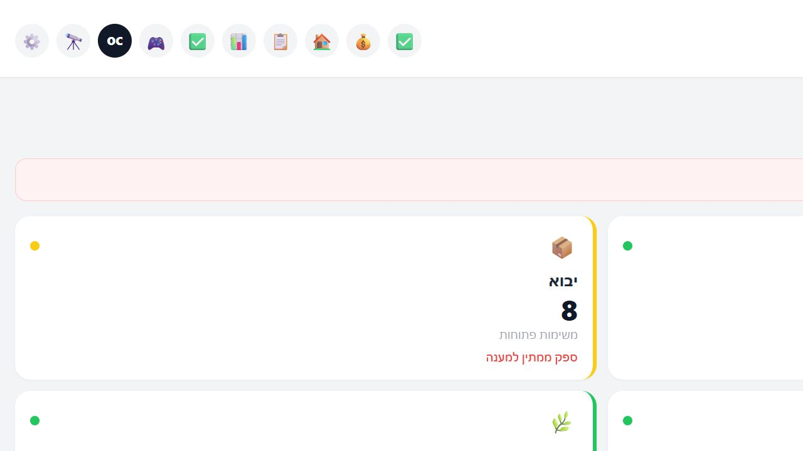

- חוזקות: KPI גלובליים, חריגים וכרטיסי פרויקט הם בסיס טוב ל־Command Center.
- סיכון מרכזי: 10 כפתורי header באותה שורה יוצרים עומס, גלילה אופקית וחוסר עדיפות. האייקונים בלבד דורשים זכירה; OC, Ventures, Digest, Check-in ו־Game אינם מובנים באותה רמת מיידיות.
- המלצה: להפוך את ה־Hub לבית עם 3 אזורים: “לטפל עכשיו”, “סטטוס עסקי”, “קיצורי דרך”. להעביר את כל היעדים ל־bottom navigation או לתפריט More.

### 2. Approvals — בריאות: שימושי אך מבודד

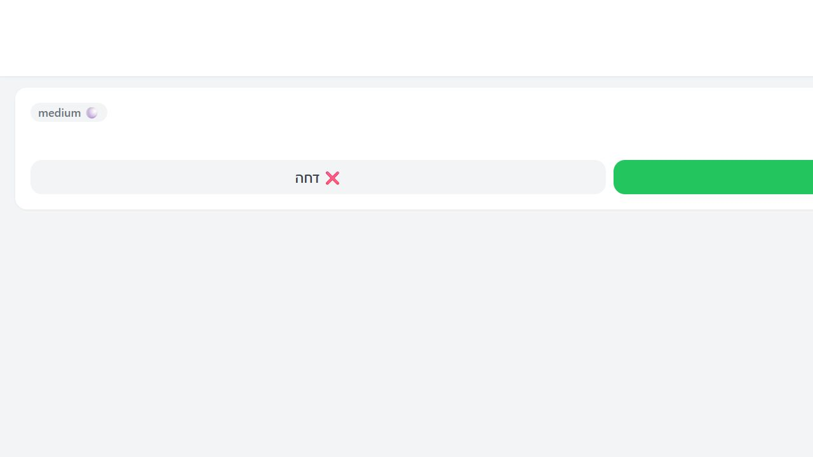

- חוזקות: מספר ממתינים, רמת סיכון ופעולות אשר/דחה ברורות.
- סיכון: אין תיאור מספיק של ההשלכה העסקית של האישור ואין receipt/מצב לאחר פעולה במסך עצמו.
- המלצה: queue אחת בתוך Command Center וב־System. לכל פריט: “מה יקרה”, מי ביקש, מתי, רמת סיכון, preview, אישור/דחייה ו־receipt.

### 3. Finance / Assets / Activity — בריאות: בינוני, פיצול גבוה

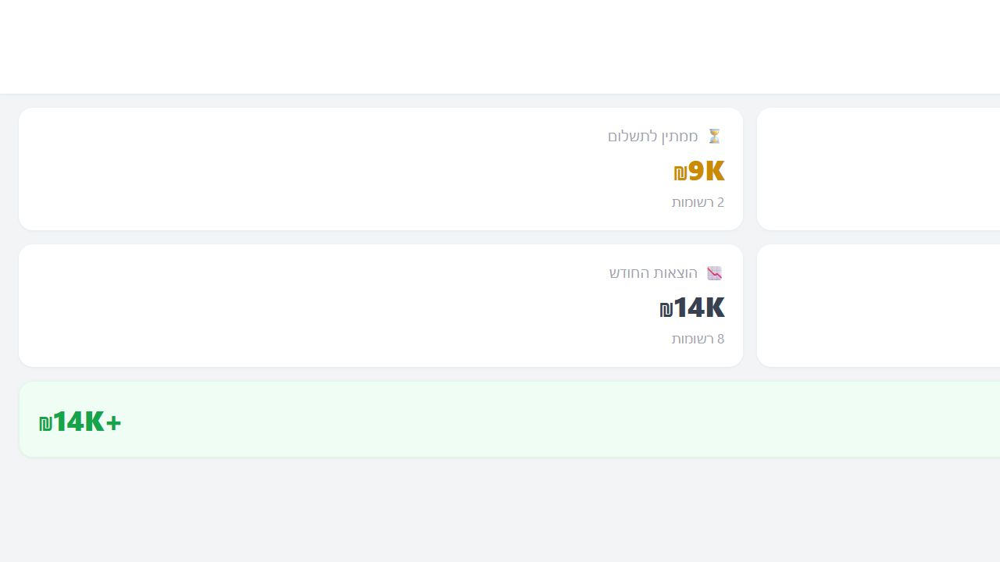

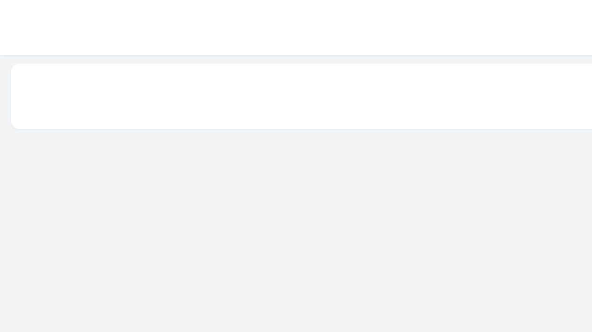

- Finance עונה על שאלה נפרדת ולכן ראוי להישאר עצמאי.
- Assets הוא תת־אזור של Operations, לא “מצב” מקביל.
- Activity כרגע הוא feed פסיבי; בלי פילטר לפי פרויקט/ליד/קשר הוא פחות שימושי לקבלת החלטה.
- המלצה: Finance עם tabs קבועים: Pulse / Payments / Expenses. Operations עם Projects / Tasks / Assets. Relationship עם Activity / Interactions / Memory.

### 4. Digest / Check-in / Game — בריאות: חפיפה גבוהה

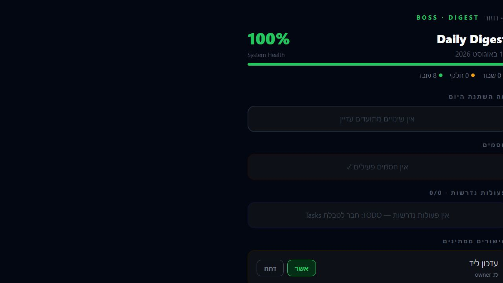
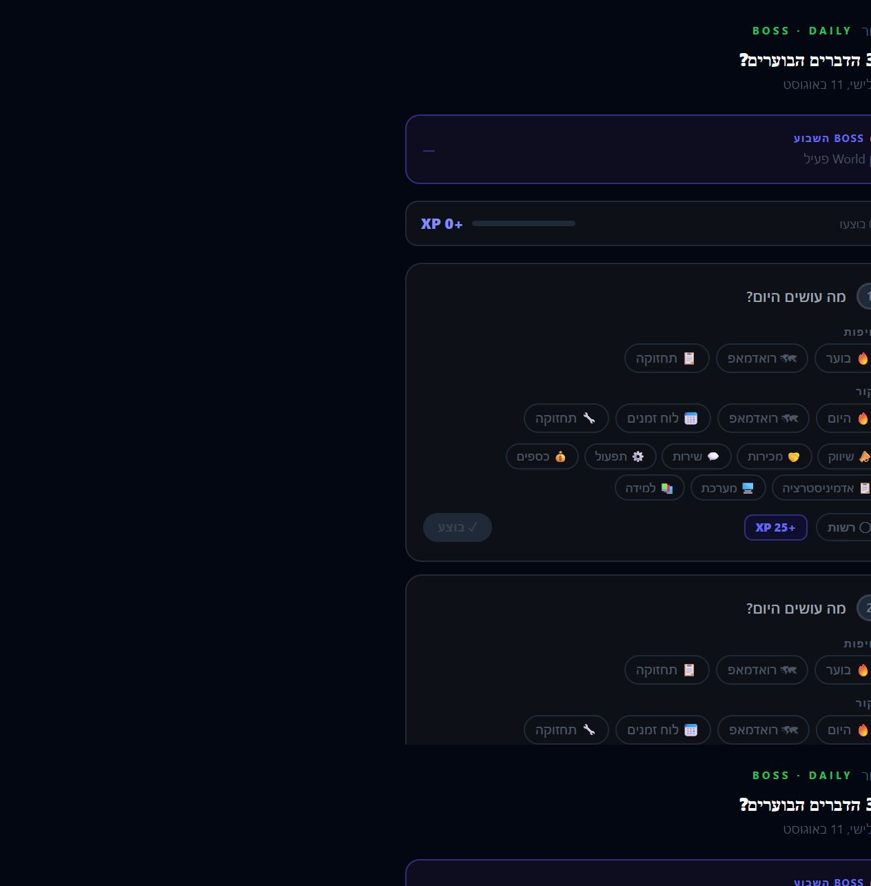
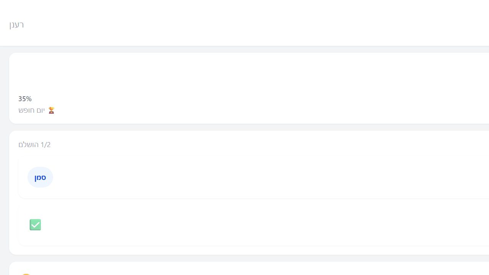

- Digest ו־Command Center מתחרים על אותו “מה השתנה ומה לעשות”.
- Check-in מציג שלושה task rows, ולכל אחד הרבה selectors; זה מתאים למסך עריכה עמוק, לא ל־daily action קצר.
- Game מציג progress/coins/quests; כ־layer הוא יכול לחזק התנהגות, אבל כיעד ניווט עצמאי הוא מגדיל עומס.
- המלצה: `BossBar` קבוע ודק בראש כל מסך, עם CTA אחד “התחל את היום”. לחיצה פותחת Check-in drawer; Game נפתח מ־BossBar או מ־Today, ללא icon ראשי.
- חובה: להציג “נשמר / לא נשמר / שומר…” באופן חד־משמעי, כפי שהתכנית כבר מזהה.

### 5. Owner Control / Ventures — בריאות: תוכן טוב, שכפול אחריות

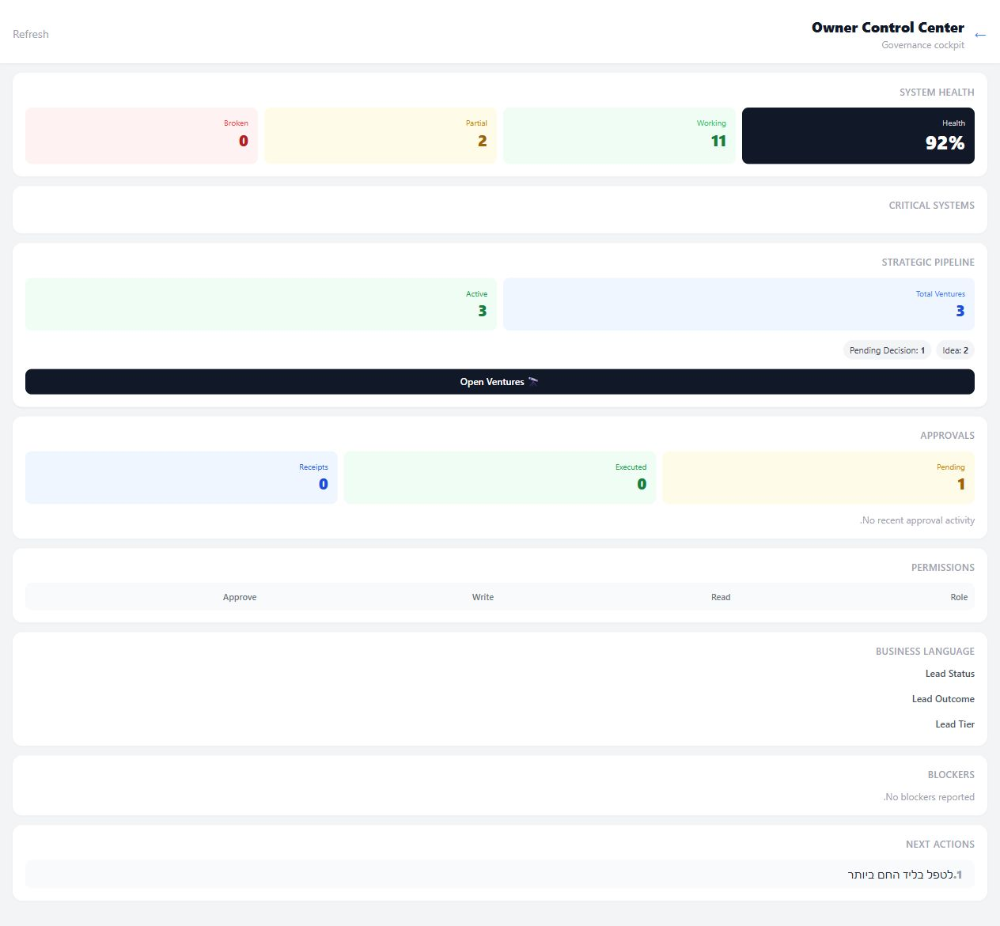
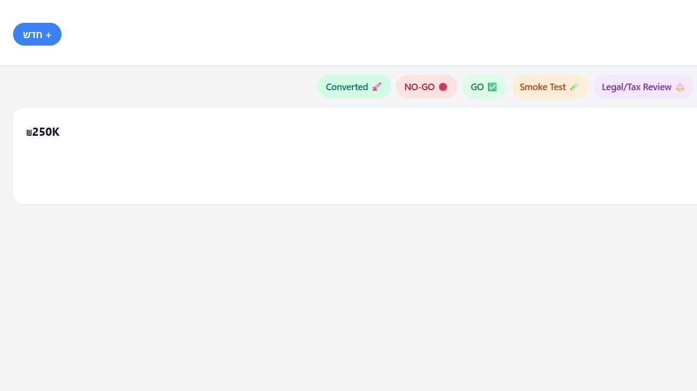

- Owner Control הוא cockpit עשיר, אבל מכיל גם System Health, Approvals, Strategic Pipeline, Permissions ו־Business Language — יותר מדי שאלות למסך מובייל אחד.
- Ventures הוא מסך עצמאי מוצדק לפי התכנית, אך ה־Strategic Pipeline מופיע גם ב־OCC.
- המלצה: Command Center מציג רק health score, blockers, approvals ו־next actions. Ventures מציג את כל ה־pipeline, עם stage tabs ופילטרים. לחיצה על count תמיד מובילה לאותו source of truth.

### 6. Pipeline / Lead Detail — בריאות: הליבה החזקה ביותר, דורשת איחוד

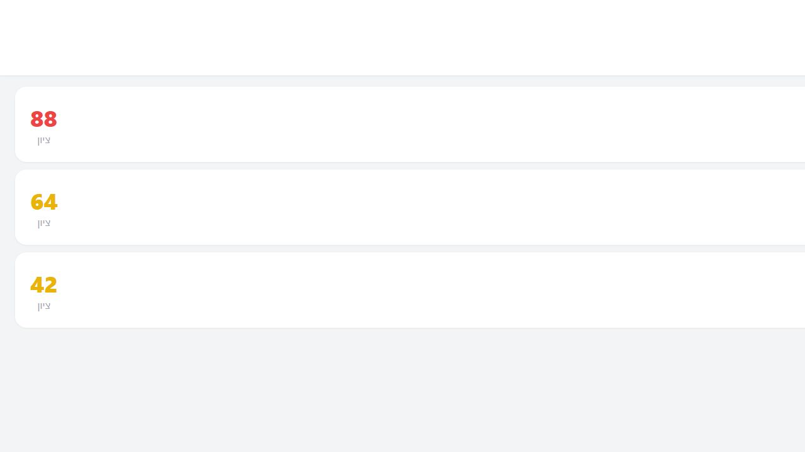
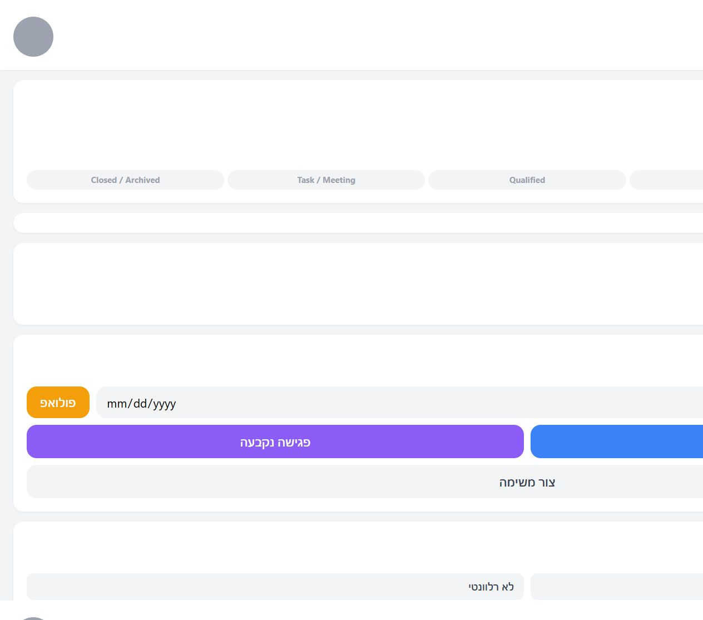

- חוזקות: workflow מפורש, next action, outcome עסקי, היסטוריה ופעולות follow-up/task.
- סיכון: יותר מדי פעולות באותו detail, כולל Ask AI, שינוי score, יצירת task, outcome ו־follow-up; היררכיית הפעולה הראשית לא תמיד חד־משמעית.
- המלצה: שלוש שכבות בלבד: header עם stage/score, פעולה ראשית אחת לפי next action, ו־timeline. פעולות נדירות/מתקדמות נכנסות ל־More. Pipeline ו־Lead Detail צריכים להיתפס כ־master-detail אחד, לא כשני מסכים בלתי קשורים.

## Accessibility וסיכוני נראות שנצפו

- סרגל הכותרת הצפוף מגדיל סיכון למטרות לחיצה קטנות ולגלילה אופקית.
- Emoji בלבד אינם תחליף לתווית גלויה; `aria-label` קיים בחלק מהכפתורים אך אינו פותר discoverability.
- צבעי סטטוס צריכים להגיע עם טקסט/אייקון נוסף; אין להסתמך על ירוק/צהוב/אדום בלבד.
- יש ערבוב עברית/אנגלית ומספר מסכים עם ניסוח טכני, מה שמעלה עומס קריאה ב־RTL.
- נדרש לבדוק בפועל keyboard/focus, contrast, screen reader, zoom, Telegram safe-area ו־dynamic viewport; אי אפשר לאשר WCAG מלא מצילומי מסך בלבד.

## השוואה לדפוסים מקובלים

ההשוואה כאן היא לפי דפוסי IA ולא לפי העתקת עיצוב:

- Linear מרכזת עבודה סביב sidebar, projects, views, filters ו־saved views; היא לא הופכת כל וריאציה של אותה רשימה ליעד ניווט נפרד. [Linear Custom Views](https://linear.app/docs/custom-views)
- Linear מציגה project overview כמרחב אחד עם properties, resources ו־milestones, ומעמיקה דרך sidebar/detail במקום לפתוח מסך נפרד לכל פרט. [Linear Project Overview](https://linear.app/docs/project-overview)
- דפוסי CRM מודרניים בנויים סביב רשימה/תצוגה מסוננת → detail → timeline/action, ולא סביב עשרות dashboards קטנים. לכן ל־TMA עדיף master-detail עבור Pipeline ו־Operations.

המסקנה: ביחס למקובל, 5 אזורי ניווט ראשיים הם יעד סביר ל־TMA קטן/בינוני; 10 אייקונים בכותרת הם מעל הצפיפות המקובלת. גם 8 עולמות בתכנית יכולים להיות הגיוניים כמודל דומיינים, אבל לא כ־8 פריטי ניווט נגישים בו־זמנית.

## סדר עדיפויות לביצוע

1. **P0 — IA:** להחליף את 10 כפתורי ה־header ב־5 אזורי ניווט + More; להגדיר Command Center כבית.
2. **P0 — איחוד BOSS:** לבנות `BossBar`; לאחד Check-in/Game סביב מודל נתונים ושכבת שירות משותפת.
3. **P0 — אישורים:** queue קנונית אחת, עם preview ו־receipt.
4. **P1 — Pipeline:** master-detail אחד ל־Leads ו־Lead Detail; פעולה ראשית לפי next action.
5. **P1 — Operations:** Projects/Tasks/Assets תחת עולם אחד; לא “Personal Mode” כיעד עצמאי.
6. **P1 — עקביות:** להגדיר AppShell, PageHeader, Section, Card, StatusBadge, EmptyState, ErrorState, Toast ו־BottomNav משותפים.
7. **P2 — Relationship/Insights:** להפוך Activity ל־Relationship Hub מסונן, ולשלב Digest בתוך Command Center.
8. **P2 — polish:** RTL, typography, contrast, target size, loading/saved/error states, ו־responsive audit ב־Telegram.

## מגבלות הראיות

- המסכים נטענו מקומית עם API דמה סינתטי כדי לאפשר בדיקת UI; לא נעשה שימוש בנתוני לקוחות או credentials.
- ה־API החי החזיר 401 בסביבת הבדיקה, לכן לא אימתתי הרשאות, נתוני Airtable אמיתיים, latency, receipt persistence או מצב production.
- חלק מהמסכים נבדקו עם נתונים מלאים וחלק עם empty states; נדרש סבב נוסף עם נתוני אמת/שמות ארוכים/שגיאות/מסכים קטנים.
- לא בוצעה בדיקת קורא מסך, keyboard, contrast מדוד או touch targets במכשיר Telegram אמיתי.

## קבצי ראיות

כל צילומי המסך נשמרו תחת `reports/tma-audit/`, וכוללים את המצבים שנלכדו באודיט זה בלבד.

